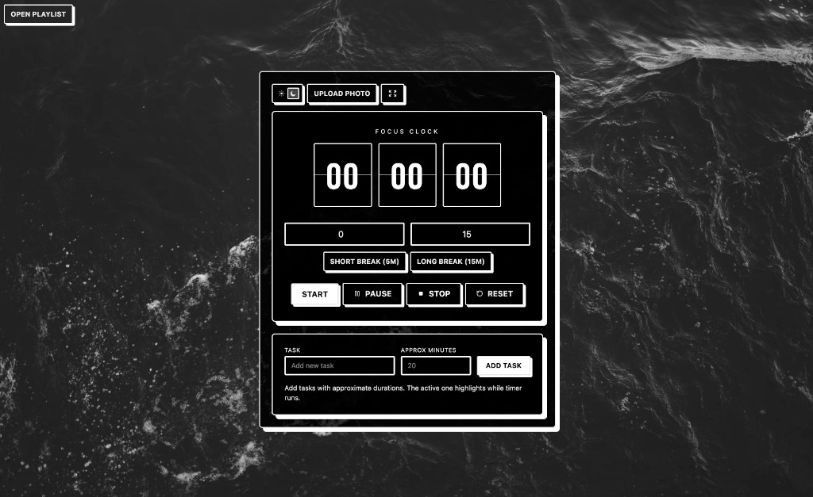
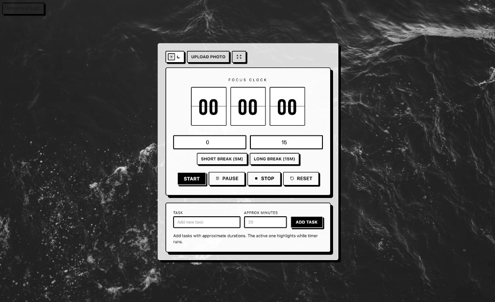
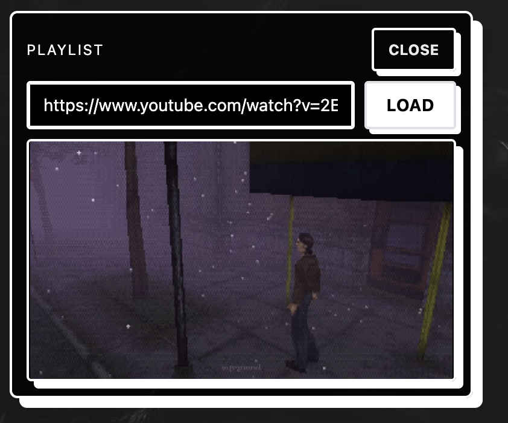

# Focus Timer

A minimal focus timer app.



## Features

- Flip-clock countdown timer with custom hours/minutes
- Short break (5m) and long break (15m) presets
- Task list with per-task time estimates and drag-to-reorder
- YouTube playlist player (paste a playlist URL)
- Custom background photo upload
- Dark / light mode toggle
- Live countdown in the browser tab title
- Completion alarm and system notification
- Installable PWA — works fully offline




## Run

```bash
npm install
npm run dev
```

created by @tiny.kiri
